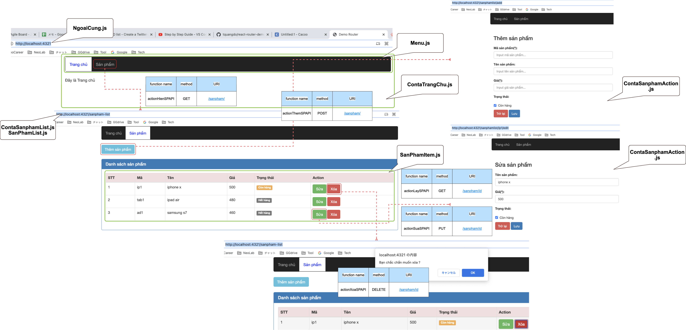
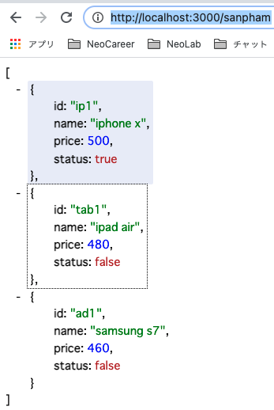

# react-router-demo-sanpham 🐳




## DB
- use `json-server`: `http://localhost:3000/sanpham`
- data in `server/db.json`



## Run
```Vim script
cd react-ui
react-ui% npm i
react-ui% npm run dev
(http://localhost:4321/)
```

### Note
- `package.json` just for deploy by Heroku (`memo.txt`)
=> NOT use, NOT exist file `server.js` in `"start": "node server",`
- change port 3000 of BE in:
1. `react-ui/src/redux/constants/ConfigConst.js: http://localhost:3000`
2. `server/index.js: const portExpress = process.env.PORT || 3000`
- change port 4321 of FE in `"dev": "concurrently \"PORT=4321 npm start\" \"npm run json-server\"",`
